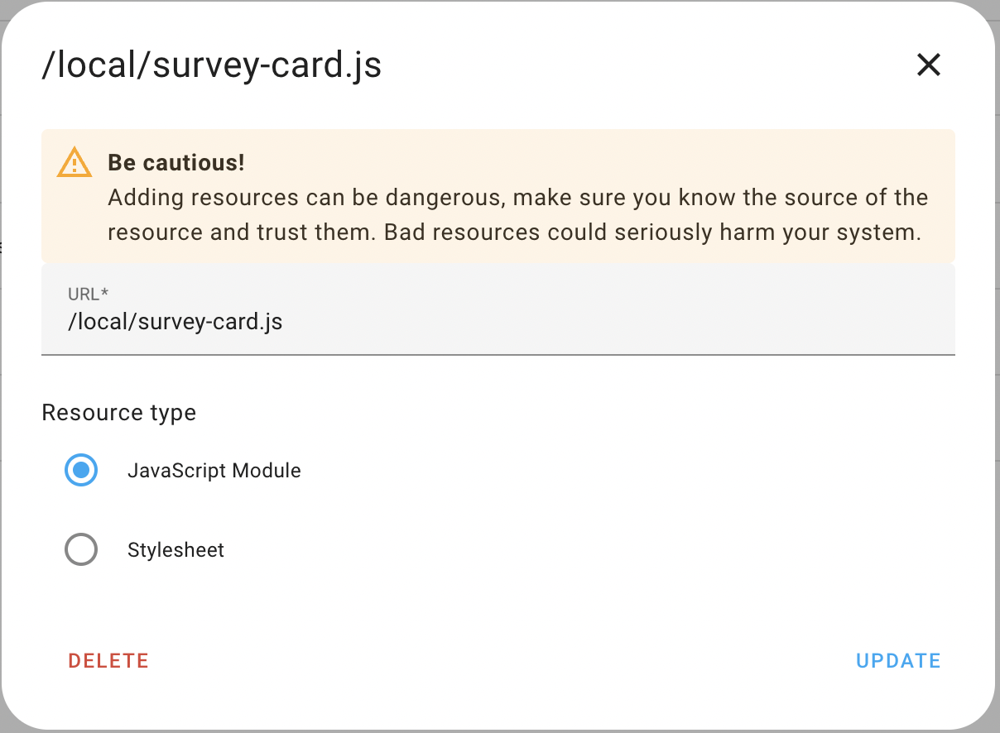
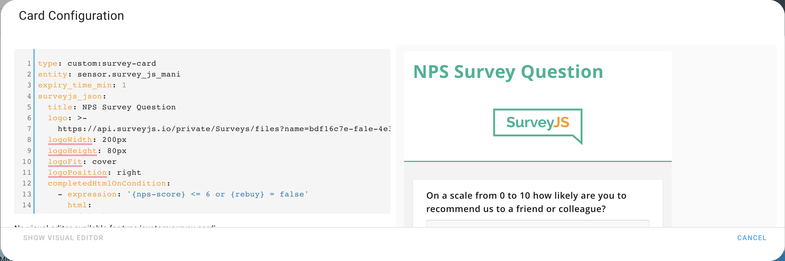
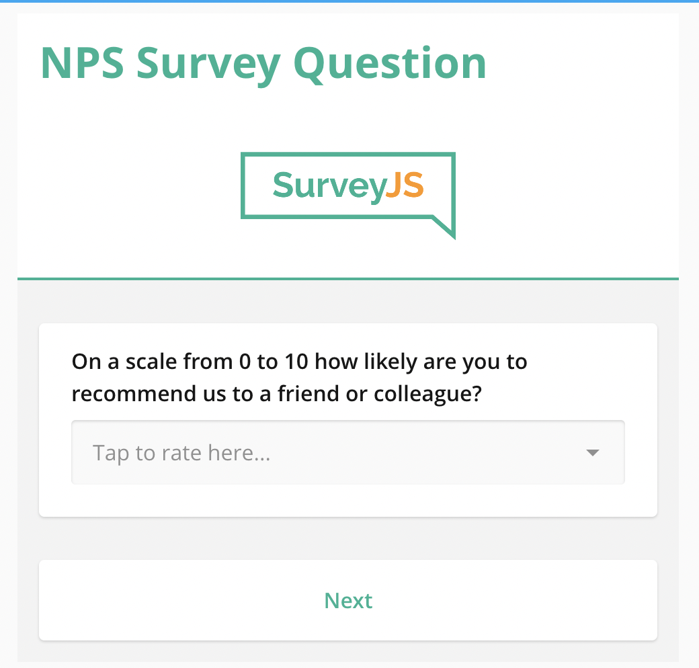

# SurveyJs Form Card
A minimal card with manual setup
***


* @published: May 2023
* @author: Manikanta Reddy Thikkavarapu
* @workspace: `config/www`

The target of this tutorial is to show minimal steps to be done to get hello
world output from a card written all by yourself. The setup is still done
manually to understand the technical requirements. More advanced solutions will
be covered by future tutorials. Please understand minimal as a reasonable
minimum to get started, not as the absolute minimum.

## Prerequisites

* [Development Environment](https://github.com/home-assistant-tutorials/01.development-environment)
* the Prerequisites named there
* basic skills of Javascript, Jquery, Web Components, Lit Library
* a workspace `config/www`

## Cloning the Repository

You may clone this repository into your workspace and follow along.
Alternatively you may want to write the code yourself, to get a deeper effect of
learning. Just decide what works best for you.

Fork the repository on Github into your own instance. Open the workspace
directory in the command-line. Call `git clone <URL>`. Use the `URL` Github does
give you, when you click the button `Code`. If your setup is well done, you
should prefer `SSH` over `HTTPS`. This allows you to easily push to your
repository.

## The Card Code

Find the code in the file named `survey-js-form-card.js` alongside with this README.

### A custom element

The card has to be a [***custom
element***](https://developer.mozilla.org/en-US/docs/Web/Web_Components/Using_custom_elements).
The class inherits from [`LitElement`](https://lit.dev).

```js
class SurveyCard extends LitElement {
```

### Visit the Official Documentation

You should know [the official
documentation](https://developers.home-assistant.io/docs/frontend/custom-ui/custom-card),
too. This tutorial is based upon it.

## Running the Code

### Adding the Ressource

Open your admin account of the development environment in the web browser. Did
you already unlock **Advanced Mode**?


Go to ***Settings*** > ***Dashboard***. Click the three dots in the upper right
hand corner to open ***Resources***. Click ***ADD RESOURCE*** in the lower right
hand corner.

As the URL enter `/local/survey-js-form-card.js`. Choose ***JavaScript Module*** and submit.



### Using the Card

Go to a dashboard. Use the three dots in the upper right hand corner to edit the
dashboard. Take control if required. Click ***+ ADD CARD***. At the bottom
select ***Manual*** to add a custom card.



In the card configuration enter:

```yaml
type: custom:survey-card
entity: sensor.survey_js_mani
expiry_time_min: 1
surveyjs_json:
  title: NPS Survey Question
  logo: >-
    https://api.surveyjs.io/private/Surveys/files?name=bdf16c7e-fa1e-4e31-9d82-a6df1982c224
  logoWidth: 200px
  logoHeight: 80px
  logoFit: cover
  logoPosition: right
  completedHtmlOnCondition:
    - expression: '{nps-score} <= 6 or {rebuy} = false'
      html:
        default: >-
          Thanks for your feedback! We highly value all ideas and suggestions
          from our customers, whether they're positive or critical. In the
          future, our team might reach out to you to learn more about how we can
          further improve our product so that it exceeds your expectations.
        fr: >-
          Merci pour vos commentaires! Nous accordons une grande importance à
          toutes les idées et suggestions de nos clients, qu'elles soient
          positives ou critiques. À l'avenir, notre équipe pourrait vous
          contacter pour en savoir plus sur la façon dont nous pouvons encore
          améliorer notre produit afin qu'il dépasse vos attentes.
    - expression: '{nps-score} = 6 or {nps-score} = 7'
      html:
        default: >-
          Thanks for your feedback. Our goal is to create the best possible
          product, and your thoughts, ideas, and suggestions play a major role
          in helping us identify opportunities to improve.
        fr: >-
          Merci pour vos commentaires. Notre objectif est de créer le meilleur
          produit possible, et vos réflexions, idées et suggestions jouent un
          rôle majeur pour nous aider à identifier les opportunités
          d'amélioration.
    - expression: '{nps-score} >= 8'
      html:
        default: >-
          Thanks for your feedback. It's great to hear that you're a fan of our
          product. Your feedback helps us discover new opportunities to improve
          it and make sure you have the best possible experience.
        fr: >-
          Merci pour vos commentaires. Nous sommes ravis d'entendre que vous
          avez apprécié notre produit. Vos commentaires nous aident à découvrir
          de nouvelles opportunités pour l'améliorer et vous assurer la
          meilleure expérience possible.
  pages:
    - name: page1
      elements:
        - type: panel
          name: nps-panel
          elements:
            - type: rating
              name: nps-score
              title:
                default: >-
                  On a scale from 0 to 10 how likely are you to recommend us to
                  a friend or colleague?
                fr: >-
                  Sur une échelle de 0 à 10, quelle est la probabilité que vous
                  recommandiez notre produit à un ami ou à un collègue?
              rateMin: 0
              rateMax: 10
              minRateDescription:
                default: Very unlikely
                fr: Très improbable
              maxRateDescription:
                default: Very likely
                fr: Très probable
            - type: comment
              name: disappointing-experience
              visibleIf: '{nps-score} <= 5'
              title:
                default: >-
                  How did we disappoint you and what can we do to make things
                  right?
                fr: >-
                  Nous n'avons pas été a la hauteur de vos attentes, comment
                  pouvons-nous améliorer?
              maxLength: 300
            - type: comment
              name: improvements-required
              visibleIf: '{nps-score} >= 6'
              title:
                default: What can we do to make your experience more satisfying?
                fr: >-
                  Que pouvons-nous faire pour rendre votre expérience plus
                  satisfaisante?
              maxLength: 300
            - type: checkbox
              name: promoter-features
              visibleIf: '{nps-score} >= 9'
              title:
                default: Which of the following features do you value the most?
                fr: >-
                  Laquelle des fonctionnalités suivantes appréciez-vous le plus
                  ?
              description:
                default: Please select no more than three features.
                fr: Veuillez ne pas sélectionner plus de trois fonctionnalités.
              isRequired: true
              choices:
                - value: performance
                  text: Performance
                - value: stability
                  text:
                    default: Stability
                    fr: Stabilité
                - value: ui
                  text:
                    default: User interface
                    fr: Interface utilisateur
                - value: complete-functionality
                  text:
                    default: Complete functionality
                    fr: Ensemble des fonctionnalités
                - value: learning-materials
                  text:
                    default: Learning materials (documentation, demos, code examples)
                    fr: >-
                      Matériel d'apprentissage (documentation, démos, exemples
                      de code)
                - value: support
                  text:
                    default: Quality support
                    fr: Accompagnement de qualité
              showOtherItem: true
              otherPlaceholder:
                default: Please specify...
                fr: Veuillez préciser...
              otherText:
                default: Other features
                fr: Autres fonctionnalités
              colCount: 2
              maxSelectedChoices: 3
        - type: boolean
          name: rebuy
          title:
            default: Would you buy our product again?
            fr: Achèteriez-vous à nouveau notre produit?
        - type: panel
          name: testimonal-request
          elements:
            - type: radiogroup
              name: testimonial
              title:
                default: >-
                  Would you mind providing us a brief testimonial for the
                  website?
                fr: >-
                  Accepteriez-vous de rédiger un bref commentaire pour notre
                  site Internet?
              choices:
                - value: 'yes'
                  text:
                    default: Sure!
                    fr: Bien sur!
                - value: 'no'
                  text:
                    default: 'No'
                    fr: Non merci.
            - type: text
              name: email
              visibleIf: '{testimonial} = ''yes'''
              title:
                default: What is your email address?
                fr: Quelle est votre adresse e-mail?
              validators:
                - type: email
              placeholder:
                default: Enter your email here
                fr: Veuillez saisir votre adresse e-mail ici
  showPrevButton: false
  showQuestionNumbers: 'off'
  completeText:
    fr: Envoyer
  questionsOnPageMode: questionPerPage
  widthMode: static
  width: 1000px
```

Don't forget the `custom` prefix, as you add a custom card. The type of the card
is the type you did register in the last line of the `card.js` file:

```js
customElements.define("survey-card", SurveyCard);
```

If everything went well so far, congratulations! You should now see the output of the first card you created yourself. Try different entities.



### Survey Js Form Card Explained

```js
import { LitElement, html, css } from "https://unpkg.com/lit-element@2.0.1/lit-element.js?module";
import "https://unpkg.com/jquery";

function loadCSS(url) {
  const link = document.createElement("link");
  link.type = "text/css";
  link.rel = "stylesheet";
  link.href = url;
  document.head.appendChild(link);
}

loadCSS("https://unpkg.com/survey-jquery@1.9.84/defaultV2.min.css");

class SurveyCard extends LitElement {
  static get properties() {
    return {
      config: { type: Object },
    };
  }

  setConfig(config) {
    console.log("Config", this, config);
    this.config = config;
    this.survey = null;
    this.survey_timer = null;
    this.survey_state = "";

    setTimeout(() => {
      this._hass.callApi("GET", "states/" + this.config.entity).then((data) => {
        console.log("Get Entity Data", data);
        if (data.state === "survey sent" || data.state === "survey started") {
          this.startTimer(data.state);
        } else {
          clearInterval(this.survey_timer);
          console.log("Interval Cleared");
        }
        console.log(this.survey_timer);
      });
    }, 500);
  }

  set hass(hass) {
    console.log("Hass", hass);
    this._hass = hass;
  }

  firstUpdated() {
    console.log("Hi");
    var thisNode = this;
    $(document).ready(function () {
      console.log("Jquery working");
      $.getScript("https://unpkg.com/survey-jquery/survey.jquery.min.js").done(
        (script, textStatus) => {
          console.log(thisNode);
          thisNode.constructSurveyUI();
        }
      );
    });
  }

  startTimer(state) {
    var countDownDate;
    if (state == "") {
      countDownDate = new Date();
      countDownDate.setMinutes(
        countDownDate.getMinutes() + this.config.expiry_time_min
      );
      this._hass.callApi("POST", "states/" + this.config.entity, {
        state: "survey started",
        attributes: {
          start_timer_date: countDownDate.getTime(),
        },
      });
    } else if (state == "survey started") {
      this._hass.callApi("GET", "states/" + this.config.entity).then((data) => {
        console.log("Get Entity Data", data);
        countDownDate = new Date(data.attributes.start_timer_date);
      });
    }

    var thisHassNode = this;

    this.survey_timer = setInterval(function () {
      var now = new Date().getTime();

      var distance = countDownDate - now;

      if (distance < 0) {
        clearInterval(thisHassNode.survey_timer);
        thisHassNode.survey_state = "partial survey received";
        thisHassNode.survey.doComplete();
      }
    }, 1000);
  }

  constructSurveyUI() {
    console.log("Script accesed", Survey, "Config", this.config);
    this.survey = new Survey.Model(this.config.surveyjs_json);
    console.log("Survey Model", this.survey);

    this.survey_state = "survey received";

    this.survey.onComplete.add((sender) => {
      const results = {
        user_name: this._hass.user.name,
        survey_trigger: "Temp Change",
        survey_response: sender.data,
      };

      this._hass
        .callApi("POST", "states/" + this.config.entity, {
          state: sender.data ? this.survey_state : "survey not received",
          attributes: results,
        })
        .then((data) => {
          console.log("Post Entity Data", data);
          clearInterval(this.survey_timer);
          let thank_you_element =
            this.shadowRoot.querySelector(".sd-completedpage");
          thank_you_element.innerText =
            "Thank you for your response! Click here to return home.";
          thank_you_element.style.cursor = "pointer";
          thank_you_element.onclick = function () {
            window.location.href = "/";
          };
        });
    });

    $(this.shadowRoot.getElementById("surveyElement")).Survey({
      model: this.survey,
    });
  }

  render() {
    return html` <div id="surveyElement"></div> `;
  }

  static get styles() {
    return css`
    // WRITE DOWN THE CSS HERE
        `;
  }
}

customElements.define("survey-card", SurveyCard);
```

## Imports

We need import two packages [Lit & JQuery] initially.

```js
import { LitElement, html, css } from "https://unpkg.com/lit-element@2.0.1/lit-element.js?module";
import "https://unpkg.com/jquery";
```

## Functions

a) SurveyJs CSS Loader 

```js
function loadCSS(url) {
  const link = document.createElement("link");
  link.type = "text/css";
  link.rel = "stylesheet";
  link.href = url;
  document.head.appendChild(link);
}

loadCSS("https://unpkg.com/survey-jquery@1.9.84/defaultV2.min.css");
```

b) SurveyJs Lit component 

```js
class SurveyCard extends LitElement {
}
customElements.define("survey-card", SurveyCard);
```

c) Initialize variables

```js
  static get properties() {
    return {
      config: { type: Object },
    };
  }
```

d) Config setters [Similar to general constructor]

- Initializing few variables
- API call to get entity details

```js
  setConfig(config) {
    console.log("Config", this, config);
    this.config = config;
    this.survey = null;
    this.survey_timer = null;
    this.survey_state = "";

    setTimeout(() => {
      this._hass.callApi("GET", "states/" + this.config.entity).then((data) => {
        console.log("Get Entity Data", data);
        if (data.state === "survey sent" || data.state === "survey started") {
          this.startTimer(data.state);
        } else {
          clearInterval(this.survey_timer);
          console.log("Interval Cleared");
        }
        console.log(this.survey_timer);
      });
    }, 500);
  }
```

e) Hass setter

```js
  set hass(hass) {
    console.log("Hass", hass);
    this._hass = hass;
  }
```

f) First updated [the official documentation](https://lit.dev/docs/v1/components/lifecycle/#firstupdated)

We are importing the survey jquery package here rather than at the beginning since these cdn packages are asynchronous and we need to ensure that jquery is loaded first before importing surveyjs jquery.

```js
  firstUpdated() {
    console.log("Hi");
    var thisNode = this;
    $(document).ready(function () {
      console.log("Jquery working");
      $.getScript("https://unpkg.com/survey-jquery/survey.jquery.min.js").done(
        (script, textStatus) => {
          console.log(thisNode);
          thisNode.constructSurveyUI();
        }
      );
    });
  }
```

g) Constructing SurveyJs UI [the official documentation](https://surveyjs.io/form-library/documentation/get-started-jquery)

```js
    constructSurveyUI() {
    console.log("Script accesed", Survey, "Config", this.config);
    this.survey = new Survey.Model(this.config.surveyjs_json);
    console.log("Survey Model", this.survey);

    this.survey_state = "survey received";

    this.survey.onComplete.add((sender) => {
      const results = {
        user_name: this._hass.user.name,
        survey_trigger: "Temp Change",
        survey_response: sender.data,
      };

      this._hass
        .callApi("POST", "states/" + this.config.entity, {
          state: sender.data ? this.survey_state : "survey not received",
          attributes: results,
        })
        .then((data) => {
          console.log("Post Entity Data", data);
          clearInterval(this.survey_timer);
          let thank_you_element =
            this.shadowRoot.querySelector(".sd-completedpage");
          thank_you_element.innerText =
            "Thank you for your response! Click here to return home.";
          thank_you_element.style.cursor = "pointer";
          thank_you_element.onclick = function () {
            window.location.href = "/";
          };
        });
    });

    $(this.shadowRoot.getElementById("surveyElement")).Survey({
      model: this.survey,
    });
  }
```

h) Timer logic

We are utilizing a countdown timer so that the user can submit their response before the timer expires.

```js
  startTimer(state) {
    var countDownDate;
    if (state == "") {
      countDownDate = new Date();
      countDownDate.setMinutes(
        countDownDate.getMinutes() + this.config.expiry_time_min
      );
      this._hass.callApi("POST", "states/" + this.config.entity, {
        state: "survey started",
        attributes: {
          start_timer_date: countDownDate.getTime(),
        },
      });
    } else if (state == "survey started") {
      this._hass.callApi("GET", "states/" + this.config.entity).then((data) => {
        console.log("Get Entity Data", data);
        countDownDate = new Date(data.attributes.start_timer_date);
      });
    }

    var thisHassNode = this;

    this.survey_timer = setInterval(function () {
      var now = new Date().getTime();

      var distance = countDownDate - now;

      if (distance < 0) {
        clearInterval(thisHassNode.survey_timer);
        thisHassNode.survey_state = "partial survey received";
        thisHassNode.survey.doComplete();
      }
    }, 1000);
  }
```
i) UI render

```js
  render() {
    return html` <div id="surveyElement"></div> `;
  }
```

j) CSS

```js
  static get styles() {
    return css`
    // WRITE DOWN THE CSS HERE
        `;
  }
```